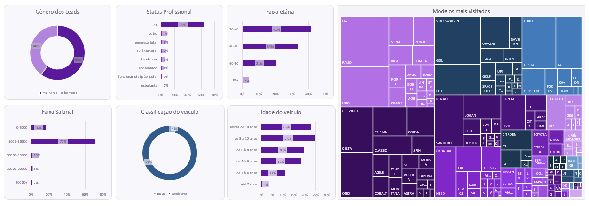

# Dashboard de Perfil dos Leads

Projeto desenvolvido durante o curso **SQL para Análise de Dados: Do básico ao avançado**, utilizando PostgreSQL para consultar os dados e Microsoft Excel para construir o dashboard.

O objetivo foi analisar características dos clientes cadastrados e a distribuição das visitas aos veículos, praticando consultas SQL, cálculos percentuais e visualização de dados.

## Dashboard



[Consultar o dashboard em Excel](dashboard/dashboard-perfil-dos-leads.xlsx)

## Perguntas analisadas

- Como os leads se distribuem por gênero estimado?
- Quais são os status profissionais mais frequentes?
- Como os leads se distribuem por faixa etária?
- Quais faixas de renda concentram mais leads?
- Qual é a proporção de visitas a veículos classificados como novos e seminovos?
- Como as visitas se distribuem por idade dos veículos?
- Quantas visitas cada combinação de marca e modelo recebeu?

## Tecnologias utilizadas

- **SQL:** consultas, junções, agrupamentos e cálculos;
- **PostgreSQL:** sistema de gerenciamento do banco de dados;
- **pgAdmin:** execução das consultas;
- **Microsoft Excel:** organização dos resultados e construção do dashboard.

## Organização do repositório

| Caminho | Conteúdo |
|---|---|
| `consultas/` | Consultas SQL utilizadas na análise |
| `dashboard/dashboard-perfil-dos-leads.xlsx` | Planilha com os resultados e o dashboard |
| `imagens/dashboard.png` | Imagem do dashboard |
| `imagens/schema-banco-de-dados.png` | Diagrama da base utilizada no curso |
| `README.md` | Apresentação e documentação do projeto |

### Consultas SQL

| Arquivo | Objetivo |
|---|---|
| [01-genero-dos-leads.sql](consultas/01-genero-dos-leads.sql) | Contar os leads por gênero estimado a partir do primeiro nome |
| [02-status-profissional-dos-leads.sql](consultas/02-status-profissional-dos-leads.sql) | Calcular a distribuição percentual por status profissional |
| [03-faixa-etaria-dos-leads.sql](consultas/03-faixa-etaria-dos-leads.sql) | Calcular a distribuição percentual por faixa etária |
| [04-faixa-salarial-dos-leads.sql](consultas/04-faixa-salarial-dos-leads.sql) | Calcular a distribuição percentual por faixa de renda |
| [05-classificacao-dos-veiculos.sql](consultas/05-classificacao-dos-veiculos.sql) | Contar as visitas a veículos classificados como novos e seminovos |
| [06-idade-dos-veiculos.sql](consultas/06-idade-dos-veiculos.sql) | Calcular a distribuição percentual das visitas por idade do veículo |
| [07-veiculos-mais-visitados-por-marca.sql](consultas/07-veiculos-mais-visitados-por-marca.sql) | Contar as visitas por marca e modelo, com ordenação alfabética |

## Banco de dados

O projeto utiliza a base disponibilizada no curso, com informações de clientes, veículos e visitas ao site.

As consultas utilizam os schemas `sales` e `temp_tables`.

### Diagrama da estrutura


O diagrama apresenta a estrutura geral da base do curso. As tabelas utilizadas neste projeto estão descritas abaixo.

### Tabelas utilizadas

| Tabela | Dados utilizados | Chave primária |
|---|---|---|
| `sales.customers` | Primeiro nome, nascimento, renda e status profissional | `customer_id` |
| `sales.funnel` | Registros de visitas, data de acesso e identificação do produto | `visit_id` |
| `sales.products` | Marca, modelo e ano do veículo | `product_id` |
| `temp_tables.ibge_genders` | Associação entre primeiro nome e gênero | `first_name` |

### Relacionamentos utilizados

| Tabelas | Coluna utilizada |
|---|---|
| `sales.customers` e `temp_tables.ibge_genders` | `first_name`, convertido para letras minúsculas |
| `sales.funnel` e `sales.products` | `product_id` |

Essas associações são realizadas por meio de `LEFT JOIN`. O script da base define chaves primárias, mas não declara restrições de chave estrangeira (`FOREIGN KEY`).

### Acesso à base

A base e o script de criação e preenchimento das tabelas são disponibilizados nos materiais do curso e não estão incluídos neste repositório.

Para executar as consultas, é necessário preparar um banco PostgreSQL com essa base ou uma estrutura compatível.

### Função personalizada `datediff`

A consulta de faixa etária utiliza a função `datediff`, criada durante as aulas do curso. Ela não é uma função nativa do PostgreSQL.

Antes de executar `03-faixa-etaria-dos-leads.sql`, é necessário criar essa função no banco utilizado pelo projeto.

Sua definição pode ser consultada nas anotações do repositório [SQL para Análise de Dados](https://github.com/mclarafl/sql-para-analise-de-dados).

## Critérios da análise

### Perfil dos leads

Nas consultas de gênero, status profissional, faixa etária e faixa salarial, o termo **leads** representa os registros da tabela `sales.customers`.

Os percentuais de status profissional, faixa etária e renda utilizam o total dessa tabela como denominador.

O gênero é estimado pela associação do primeiro nome à tabela `temp_tables.ibge_genders`. Não se trata de uma informação autodeclarada.

A faixa salarial utiliza a coluna `income`, que representa a renda registrada na base.

### Faixas etárias e de renda

As condições utilizam limites superiores exclusivos. Por exemplo:

- `20-40`: resultado do cálculo de idade maior ou igual a 20 e menor que 40;
- `5000-10000`: renda maior ou igual a R$ 5.000 e menor que R$ 10.000.

A consulta de faixa etária utiliza `current_date`. Por isso, seus resultados podem mudar conforme a data de execução e o cálculo definido na função personalizada `datediff`.

### Veículos visitados

As análises de veículos contabilizam registros da tabela `sales.funnel`, e não veículos únicos. Um mesmo veículo pode aparecer em várias visitas.

A idade do veículo é calculada pela diferença entre o ano da visita e o ano do modelo:

```sql
extract('year' from visit_page_date) - pro.model_year::int
```

A classificação segue a regra adotada na atividade:

- **Novo:** idade calculada de até dois anos;
- **Seminovo:** idade calculada superior a dois anos.

Na distribuição por idade dos veículos, cada condição é avaliada após a anterior. Assim, a faixa seguinte à de até dois anos considera idades maiores que dois e menores ou iguais a quatro, e assim sucessivamente.

A consulta por marca e modelo apresenta todas as combinações encontradas, em ordem alfabética. Não há filtro de top 5 ou top 10.

### Período

As consultas não aplicam um filtro de período: utilizam os registros disponíveis nas respectivas tabelas.

A idade dos clientes utiliza a data da execução como referência. A idade dos veículos utiliza o ano de cada visita.

## Resultados observados

Na versão disponibilizada da planilha:

| Resultado | Valor |
|---|---|
| Registros na distribuição por gênero | 25.109 |
| Registros associados ao gênero feminino | 15.106 |
| Registros associados ao gênero masculino | 10.003 |
| Status profissional mais frequente | CLT — aproximadamente 64,94% |
| Faixa de renda mais frequente | De R$ 5.000 a menos de R$ 10.000 — aproximadamente 71,03% |
| Visitas a veículos | 30.580 |
| Visitas a veículos classificados como novos | 1.162 |
| Visitas a veículos classificados como seminovos | 29.418 |

Os resultados descrevem os dados utilizados na atividade e os critérios das consultas.

## Como utilizar

### Visualizar o dashboard

1. Veja a imagem disponível neste README;
2. Acesse o arquivo da pasta `dashboard` e faça o download;
3. Abra a planilha no Microsoft Excel;
4. Consulte a aba `Dashboard` para visualizar os gráficos;
5. Acesse a aba `Output` para conferir os dados utilizados.

### Executar as consultas

1. Tenha o PostgreSQL instalado e um banco criado para os estudos;
2. Prepare a base com o script disponibilizado no curso;
3. Crie a função personalizada `datediff`, necessária para a query 3;
4. Abra os arquivos da pasta `consultas` no pgAdmin;
5. Execute cada consulta no banco correspondente.

**Atenção:** o script de preparação da base contém comandos `DROP TABLE`. Executá-lo novamente remove e recria as tabelas indicadas.

### Atualizar a planilha

1. Execute as consultas;
2. Transfira os resultados para as respectivas áreas da aba `Output`;
3. Confira a formatação dos números e percentuais;
4. Ajuste os intervalos dos gráficos se houver alteração na quantidade de linhas;
5. Confira se os gráficos refletem os novos resultados.

A transferência dos resultados é manual. A planilha não possui atualização automática conectada ao banco de dados.

## Aprendizados

Durante o projeto, pratiquei:

- Uso de `LEFT JOIN` para combinar dados;
- Padronização de textos com `LOWER`;
- Criação de categorias com `CASE WHEN`;
- Agregações com `COUNT` e `GROUP BY`;
- Cálculo de participações percentuais;
- Uso de subqueries para obter os totais;
- Organização de consultas com CTEs (`WITH`);
- Uso de uma função personalizada;
- Extração do ano de datas com `EXTRACT`;
- Ordenação alfabética e por colunas auxiliares;
- Organização de resultados e gráficos no Excel;
- Diferenciação entre contagem de clientes e contagem de visitas.

## Sobre o curso

- **Curso:** SQL para Análise de Dados: Do básico ao avançado
- **Instrutora:** Midori Toyota
- **Plataforma:** Udemy
- **Link:** [Acessar o curso](https://www.udemy.com/course/sql-para-analise-de-dados/)

Este projeto foi desenvolvido acompanhando a proposta prática do curso e integra meu processo de aprendizagem em análise de dados.

## Projetos relacionados

- [Anotações e exercícios do curso](https://github.com/mclarafl/sql-para-analise-de-dados)
- [Projeto 1 — Dashboard de Acompanhamento de Vendas](https://github.com/mclarafl/dashboard-acompanhamento-vendas)

## Autora

**Maria Clara Ferreira Lima**

[GitHub](https://github.com/mclarafl) · [LinkedIn](https://www.linkedin.com/in/mariacfl/)
